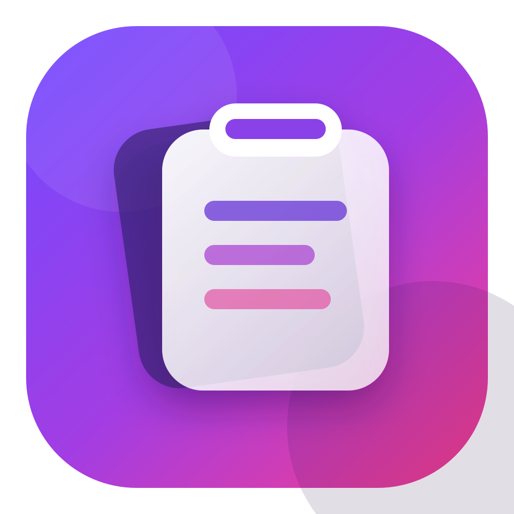
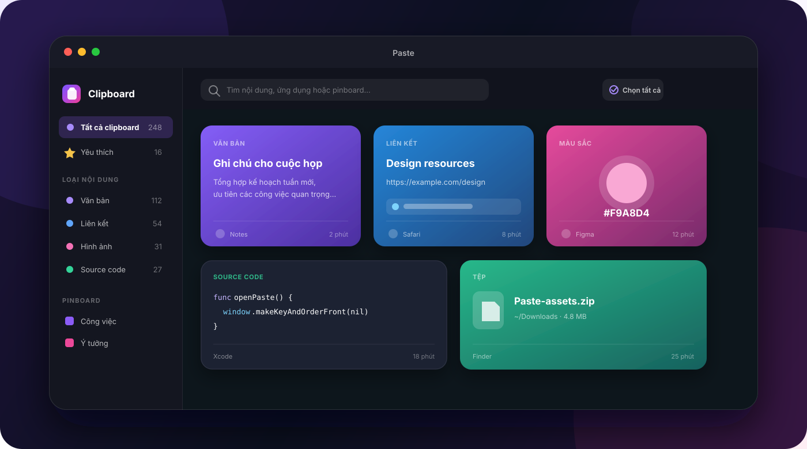

  

  <h1>Paste for macOS</h1>

  
<strong>Lưu, tìm và dán lại mọi thứ bạn đã sao chép — nhanh, đẹp và riêng tư.</strong>

  

    
  

  

    
    
    
    
  

  

    <a href="#tính-năng-nổi-bật">Tính năng</a> ·
    <a href="#bắt-đầu-nhanh">Cài đặt</a> ·
    <a href="#phím-tắt">Phím tắt</a> ·
    <a href="docs/PRIVACY.md">Quyền riêng tư</a> ·
    <a href="https://github.com/ugotuan/paste-releases/releases">Tất cả phiên bản</a>
  

---

Paste là trình quản lý clipboard native dành cho macOS. Ứng dụng tự động ghi
nhớ nội dung bạn sao chép, phân loại thành các thẻ trực quan và giúp tìm lại
trong vài giây. Toàn bộ lịch sử được mã hóa và lưu trên máy của bạn.

> [!IMPORTANT]
> Bản phát hành hiện tại dành cho **Mac Apple Silicon** (M1, M2, M3, M4 trở
> lên) và yêu cầu **macOS 14 Sonoma** hoặc mới hơn.

  

## Tính năng nổi bật

| | |
|---|---|
| **📋 Lịch sử clipboard trực quan** | Lưu văn bản, liên kết, ảnh, màu sắc, code, rich text và đường dẫn tệp dưới dạng thẻ dễ xem. |
| **⚡ Quick Picker toàn hệ thống** | Mở Paste từ bất kỳ ứng dụng nào bằng phím tắt tùy chỉnh; tìm, chọn và dán mà không rời công việc đang làm. |
| **🖼️ Preview ảnh tối ưu** | Xem ảnh trong cửa sổ lớn, zoom, cuộn và sao chép lại; ảnh dài luôn nằm gọn trong thẻ. |
| **🔎 Tìm kiếm tức thì** | Tìm theo nội dung, ứng dụng nguồn, loại dữ liệu hoặc pinboard; kết quả được lọc ngay khi nhập. |
| **🧠 Tự động phân loại** | Nhận biết liên kết, mã màu, source code, ảnh, tệp và nội dung thông thường để hiển thị phù hợp. |
| **✅ Chọn và xóa theo nhóm** | Giữ `⌘` để chọn nhiều thẻ hoặc nhấn `⌘A` để chọn tất cả kết quả đang hiển thị, sau đó xóa một lần có xác nhận. |
| **⭐ Yêu thích & Pinboard** | Đánh dấu nội dung quan trọng và gom chúng vào các pinboard riêng để truy cập nhanh. |
| **🪄 Dán ngay** | Chọn một mục rồi dán trực tiếp trở lại ứng dụng trước đó. |
| **🎛️ Tùy biến cách hoạt động** | Đổi phím tắt mở Paste, thời gian lưu dữ liệu, âm thanh, Dock, menu bar và khởi động cùng macOS. |
| **🛡️ Loại trừ ứng dụng nhạy cảm** | Không ghi clipboard khi trình quản lý mật khẩu được chọn đang hoạt động. |
| **🔄 Cập nhật tự động** | Kiểm tra phiên bản mới lúc `00:00` và `12:00`; nếu máy đang ngủ, Paste kiểm tra lại khi máy thức. |
| **🔐 Mã hóa cục bộ** | Metadata và payload được mã hóa bằng AES-256-GCM; khóa nằm trong macOS Keychain. |

## Bắt đầu nhanh

1. Tải [**Paste 1.2.1 cho Apple Silicon**](https://github.com/ugotuan/paste-releases/releases/download/v1.2.1/Paste-1.2.1-arm64.dmg).
2. Mở file `.dmg`.
3. Kéo **Paste.app** vào thư mục **Applications**.
4. Mở Paste và chọn **Open** nếu macOS hỏi xác nhận.
5. Nhấn `⌘⇧V` để mở Quick Picker.

Xem hướng dẫn chi tiết và cách xử lý cảnh báo Gatekeeper tại
[Cài đặt Paste](docs/INSTALLATION.md).

## 🧭 Cách sử dụng

### Sao chép và tìm lại

Sau khi Paste chạy, bạn chỉ cần sao chép như bình thường. Nội dung mới sẽ xuất
hiện ở đầu thư viện. Dùng thanh tìm kiếm hoặc sidebar để lọc theo loại, mục yêu
thích và pinboard.

### Mở Quick Picker

Nhấn `⌘⇧V` ở bất kỳ đâu, gõ để tìm, dùng phím mũi tên để di chuyển rồi nhấn
`Return` để dán. Quick Picker vẫn hiển thị trên các ứng dụng đang fullscreen.
Bạn có thể đổi tổ hợp này tại **Cài đặt → Chung → Phím tắt**.

### Xem ảnh lớn

Bấm icon phóng to trên thẻ ảnh hoặc chọn **Xem ảnh lớn** trong menu chuột phải
để mở preview ở giữa màn hình. Zoom bằng trackpad bám theo vị trí con trỏ; sau
khi phóng to, giữ chuột kéo ảnh để xem các vùng khác mà không di chuyển popup.
Nhấp đúp vào thẻ ảnh vẫn dán và đóng Quick Picker như các loại nội dung khác.

### Chọn và xóa nhiều mục

- Giữ `⌘` rồi nhấp từng thẻ để chọn nhiều mục.
- Nhấn `⌘A` hoặc bấm **Chọn tất cả** để chọn toàn bộ kết quả đang hiển thị.
- Nhấn nút thùng rác; Paste luôn hỏi xác nhận trước khi xóa.

“Chọn tất cả” tuân theo từ khóa và bộ lọc hiện tại. Ví dụ, khi đang xem một
pinboard, thao tác này chỉ chọn các mục trong pinboard đó.

## Phím tắt

| Phím | Tác vụ |
|---|---|
| `⌘⇧V` | Mở Quick Picker — có thể thay đổi trong Cài đặt |
| `⌘F` | Đưa con trỏ vào ô tìm kiếm |
| `⌘A` | Chọn tất cả kết quả clipboard đang hiển thị |
| `⌘` + nhấp | Thêm hoặc bỏ từng thẻ khỏi vùng chọn |
| `←` `→` `↑` `↓` | Di chuyển giữa các kết quả trong Quick Picker |
| `Return` | Dán mục đang chọn từ Quick Picker |
| `⌘1` … `⌘9` | Dán nhanh một trong chín kết quả đầu |
| `⌘⌫` | Yêu cầu xóa các mục đã chọn trong Quick Picker |
| `Esc` | Đóng Quick Picker hoặc hủy hộp xác nhận |

## 🔒 Riêng tư ngay từ thiết kế

- Lịch sử clipboard nằm tại `~/Library/Application Support/Paste/`.
- Metadata và payload đều được mã hóa xác thực bằng AES-256-GCM.
- Khóa mã hóa 256-bit được tạo ngẫu nhiên và lưu trong macOS Keychain.
- Paste không đồng bộ lịch sử clipboard lên cloud.
- Paste không tích hợp quảng cáo, analytics hoặc telemetry.
- Kiểm tra cập nhật chỉ tải appcast và bản phát hành từ GitHub.

Đọc đầy đủ tại [Quyền riêng tư & dữ liệu](docs/PRIVACY.md).

## 🔑 Quyền trên macOS

| Quyền | Khi nào cần | Bắt buộc? |
|---|---|---|
| **Login Items** | Tự chạy Paste sau khi đăng nhập | Không |
| **Accessibility** | Dùng tính năng “Dán ngay” để gửi `⌘V` tới ứng dụng khác | Không |
| **Input Monitoring** | Phím tắt mở Paste dùng API hệ thống | **Không cần** |

Bạn vẫn có thể dùng thư viện và sao chép lại nội dung mà không cấp
Accessibility.

## 🔄 Cập nhật

Paste sử dụng Sparkle 2 và chữ ký EdDSA để xác minh file cập nhật trước khi cài.
Bạn có thể:

- Đợi Paste kiểm tra tự động lúc `00:00` và `12:00`.
- Chọn **Paste → Kiểm tra cập nhật…**.
- Mở **Cài đặt → Cập nhật** để xem lần kiểm tra gần nhất.
- Tải thủ công từ trang [Releases](https://github.com/ugotuan/paste-releases/releases).

## ❓ Câu hỏi thường gặp

<strong>Paste có gửi clipboard của tôi lên internet không?</strong>

Không. Lịch sử clipboard được mã hóa và lưu cục bộ. Kết nối mạng chỉ được dùng
để kiểm tra và tải bản cập nhật từ GitHub.

<strong>Tại sao macOS cảnh báo khi mở app?</strong>

Bản hiện tại được ký ad-hoc để thử nghiệm và chưa notarize bằng Apple Developer
ID. Xem cách mở an toàn tại
[hướng dẫn cài đặt](docs/INSTALLATION.md#nếu-macos-chặn-lần-mở-đầu-tiên).

<strong>Paste có chạy trên Mac Intel không?</strong>

Chưa. File cài đặt hiện tại chỉ dành cho Apple Silicon (`arm64`).

<strong>Xóa app có xóa luôn lịch sử không?</strong>

Không. Dữ liệu nằm trong Application Support. Xem vị trí và cách xóa hoàn toàn
tại [tài liệu quyền riêng tư](docs/PRIVACY.md#xóa-dữ-liệu).

<strong>Tôi có thể đổi phím tắt mở Paste không?</strong>

Có. Mở **Cài đặt → Chung → Phím tắt**, bấm vào tổ hợp hiện tại rồi nhập tổ hợp
mới.

## 📦 Phiên bản mới nhất

### Paste 1.2.1

- Zoom ảnh theo đúng vị trí con trỏ.
- Giữ chuột kéo để xem các vùng khác của ảnh đã phóng to.
- Nút zoom giữ nguyên vùng đang xem và không còn kéo nhầm cả popup.

[Xem ghi chú phát hành](https://github.com/ugotuan/paste-releases/releases/tag/v1.2.1)
· [Tải DMG](https://github.com/ugotuan/paste-releases/releases/download/v1.2.1/Paste-1.2.1-arm64.dmg)

---

  <strong>Paste — clipboard của bạn, trên máy của bạn.</strong>
    
  <a href="https://github.com/ugotuan/paste-releases/releases">Releases</a> ·
  <a href="docs/INSTALLATION.md">Cài đặt</a> ·
  <a href="docs/PRIVACY.md">Quyền riêng tư</a>

